# RDK Log Management System - High Level Design

## Document Information

- **Version:** 1.0
- **Status:** Current Architecture Analysis
- **Purpose:** Visual representation of existing log backup and upload system
- **Scope:** Documents current (as-is) architecture without proposing changes

## Table of Contents

1. [System Overview](#1-system-overview)
2. [Architecture Components](#2-architecture-components)
3. [Data Flow Architecture](#3-data-flow-architecture)
4. [Component Interactions](#4-component-interactions)
5. [Upload Path Decision Logic](#5-upload-path-decision-logic)
6. [State Management](#6-state-management)
7. [Security Architecture](#7-security-architecture)
8. [Deployment View](#8-deployment-view)

## 1. System Overview

The RDK Log Management System provides comprehensive log backup, rotation, and upload capabilities across diverse embedded devices with varying storage and connectivity constraints.

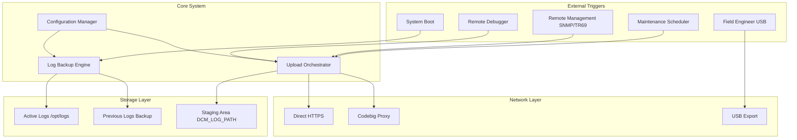

## 2. Architecture Components

### 2.1 Component Overview

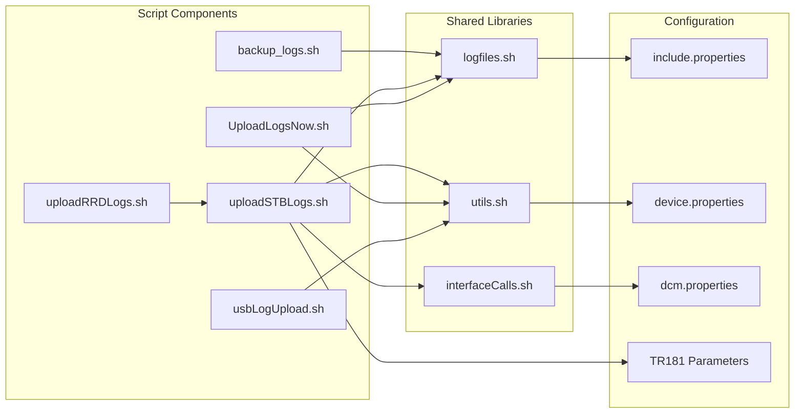

### 2.2 Component Responsibilities

| Component | Primary Responsibility | Key Functions |
|-----------|----------------------|---------------|
| `backup_logs.sh` | Log rotation and preservation | Boot-time backup, tiered rotation, version metadata |
| `uploadSTBLogs.sh` | Main upload engine | Staging, compression, protocol negotiation, retry logic |
| `UploadLogsNow.sh` | Immediate upload | Lightweight on-demand upload via SNMP/TR69 |
| `uploadRRDLogs.sh` | Debug artifact upload | Remote debugger bundle creation and delegation |
| `usbLogUpload.sh` | Manual extraction | USB-based offline log extraction |
| `logfiles.sh` | Log definitions | Variable definitions for log file patterns |
| `utils.sh` | Common utilities | MAC address, IP, timestamp functions |

## 3. Data Flow Architecture

### 3.1 Log Lifecycle Flow

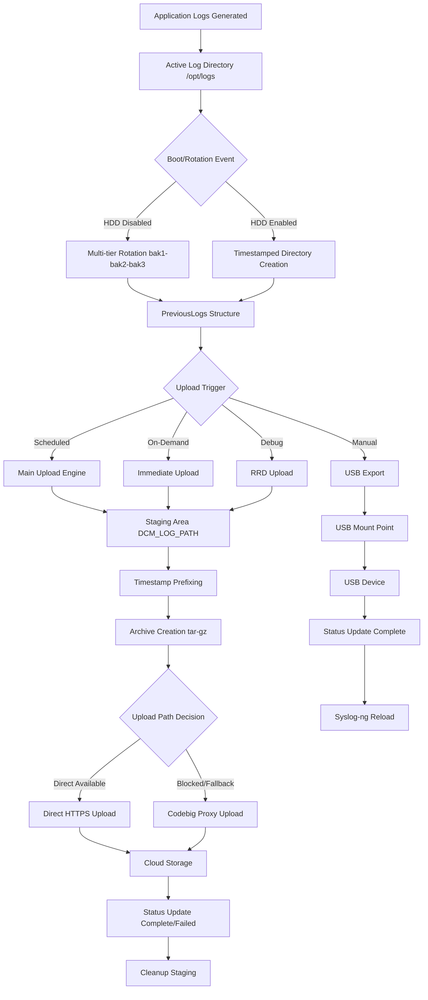

### 3.2 Configuration Flow

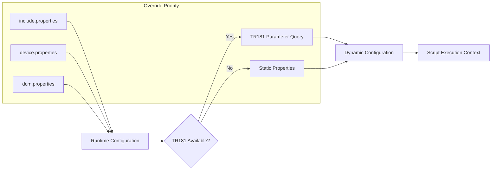

## 4. Component Interactions

### 4.1 Boot Sequence Interaction

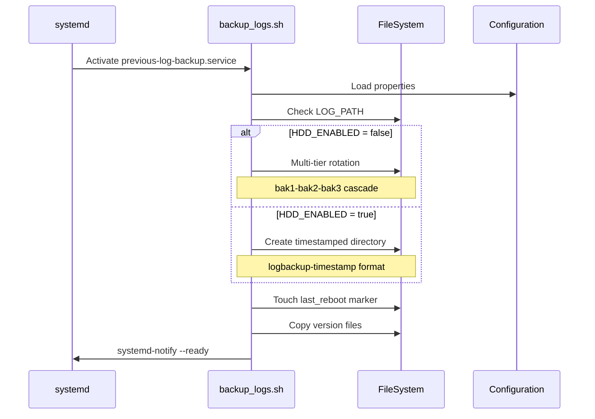

### 4.2 Upload Engine Interaction

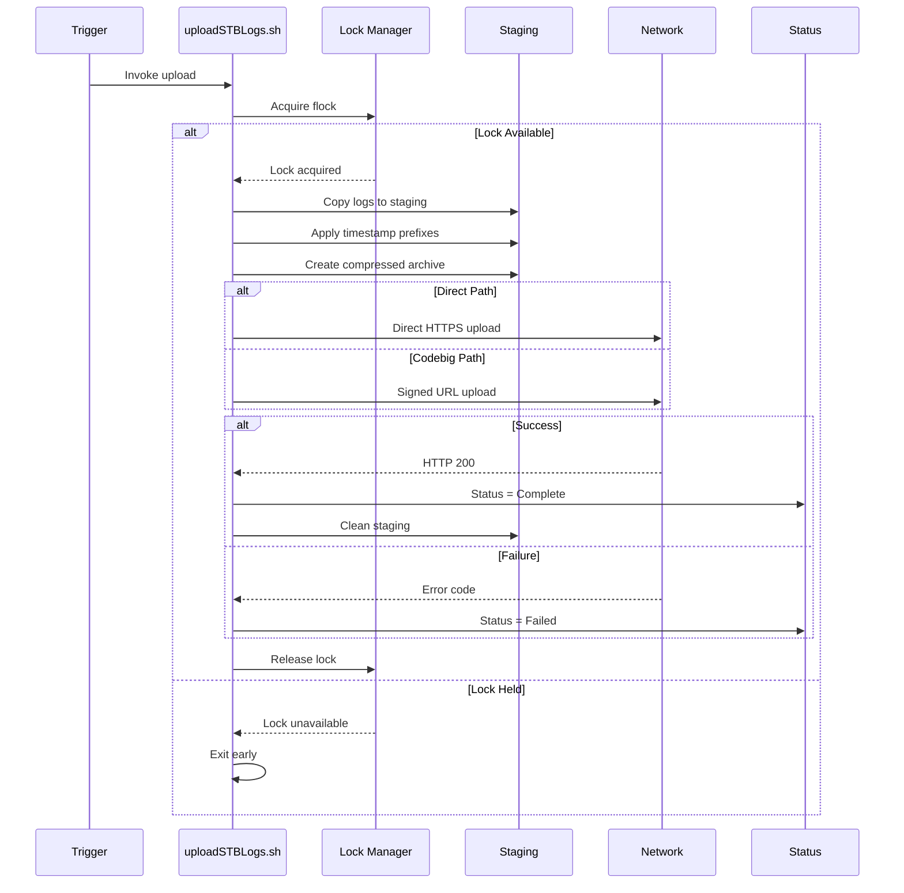

## 5. Upload Path Decision Logic

### 5.1 Path Selection Decision Tree

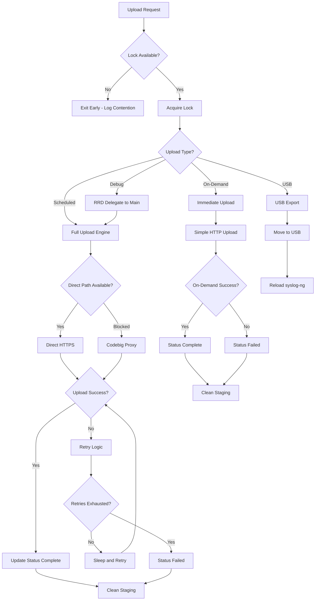

### 5.2 Protocol Selection Matrix

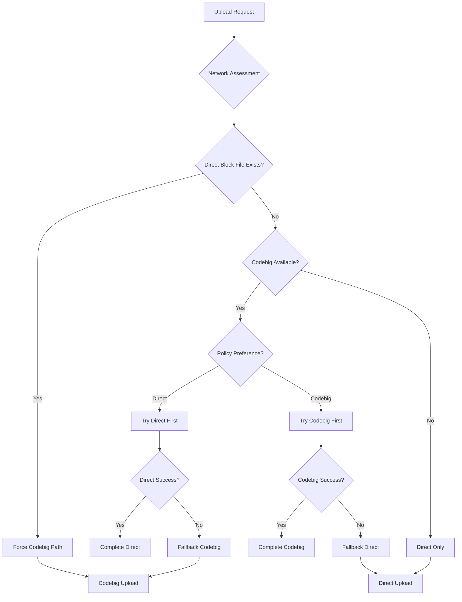

## 6. State Management

### 6.1 Upload Status State Machine

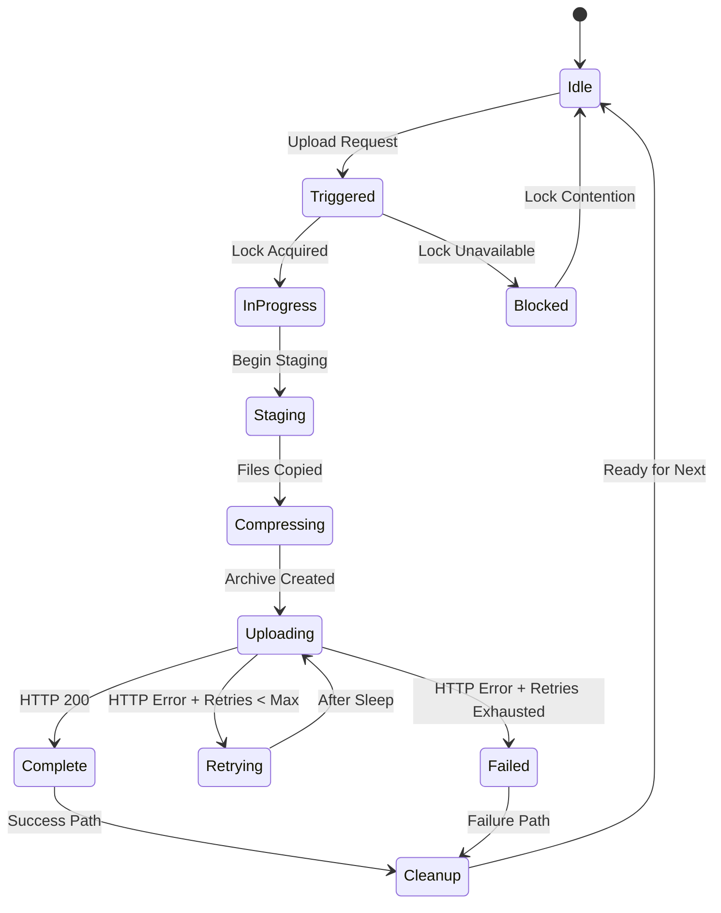

### 6.2 Log Backup State Flow

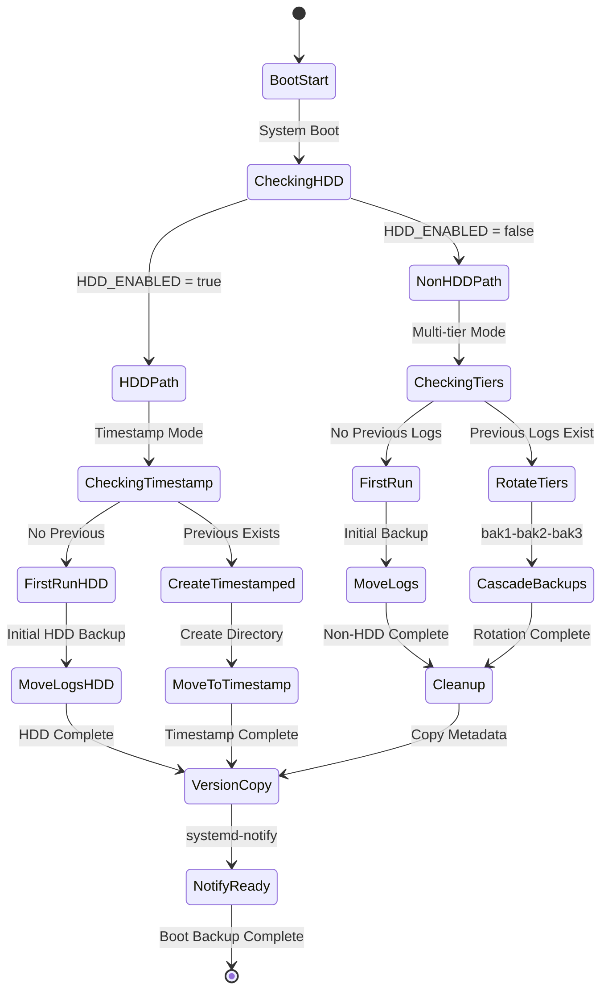

## 7. Security Architecture

### 7.1 Security Layer Integration

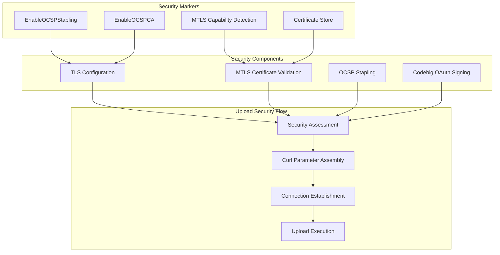

### 7.2 Security Decision Flow

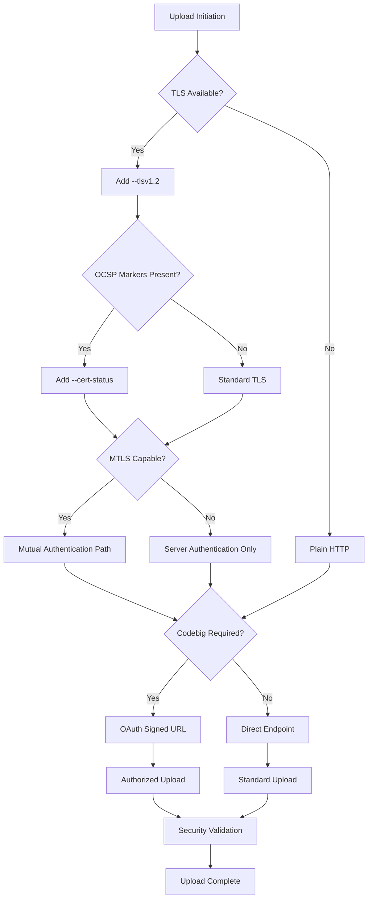

## 8. Deployment View

### 8.1 System Deployment Architecture

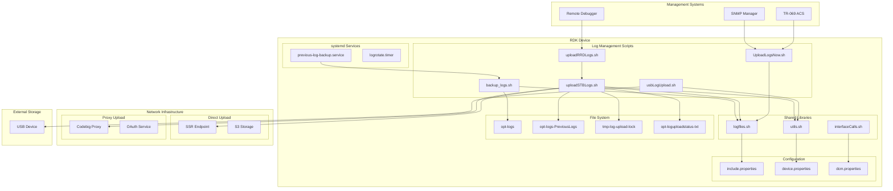

### 8.2 Runtime Environment Dependencies

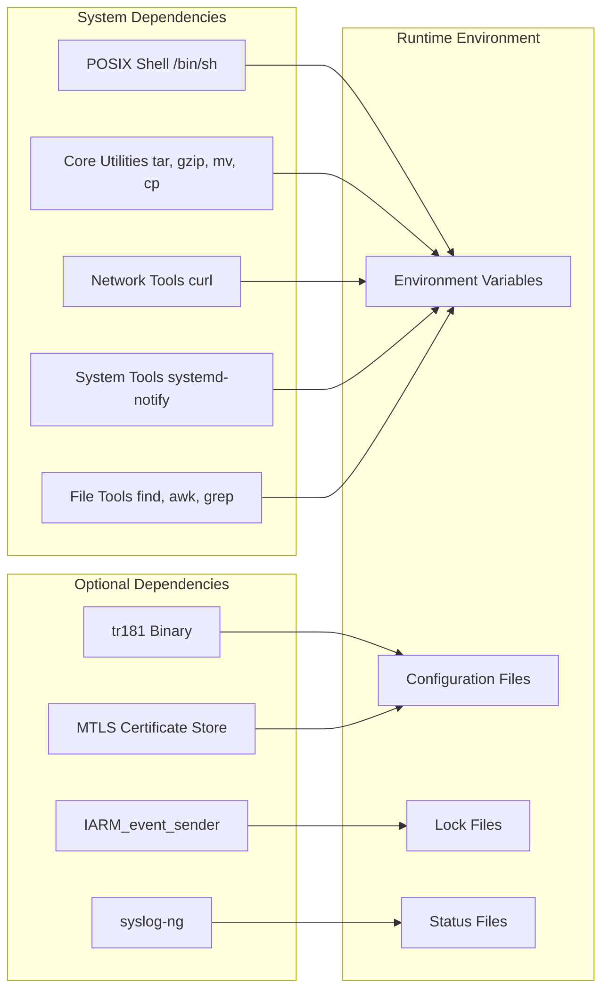

## 9. Key Architectural Characteristics

### 9.1 Current Architecture Strengths

- **Modularity**: Clear separation between backup and upload functions
- **Flexibility**: Multiple upload paths (direct, proxy, USB, debug)
- **Reliability**: Lock-based concurrency control for main engine
- **Portability**: POSIX shell compatibility across embedded platforms
- **Configurability**: Multi-layer configuration with runtime overrides

### 9.2 Current Architecture Constraints

- **Monolithic Upload Engine**: Single large script handling multiple responsibilities
- **Limited Concurrency Protection**: Not all paths use locking mechanism
- **Static Retry Logic**: Fixed retry counts without adaptive backoff
- **Manual Status Correlation**: Multiple log files for troubleshooting
- **Resource Intensive**: Full archive recreation for each upload

### 9.3 Integration Points

- **systemd Integration**: Service orchestration and readiness signaling
- **Network Stack**: Direct HTTPS and proxy-based upload protocols
- **Configuration Management**: TR181/RFC parameter integration
- **Security Infrastructure**: Optional MTLS and OCSP validation
- **Storage Management**: Multi-tier backup with device-specific logic

## Document Summary

This High Level Design document provides a comprehensive visual representation of the current RDK Log Management System architecture using Mermaid diagrams. It captures the existing implementation without suggesting modifications, serving as a reference for understanding the system's structure, data flows, and component interactions.
