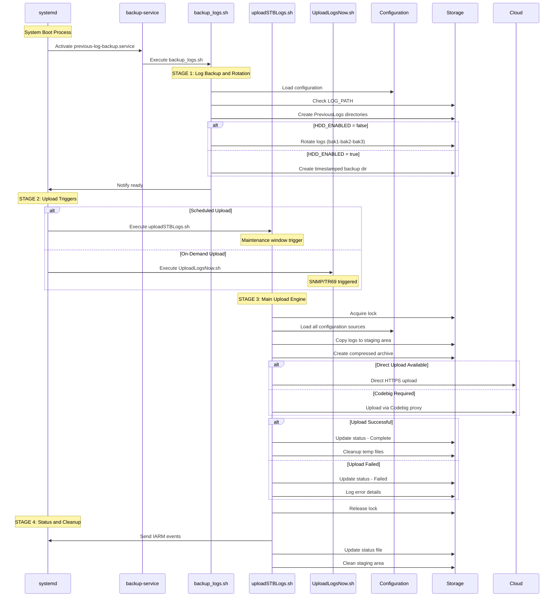

# RDK Log Management System - Sequence Diagram

## Script Invocation Flow from systemd Services



## Key Integration Points

### 1. **Systemd Service Dependencies**

```text
previous-log-backup.service:
- Before: multi-user.target  
- After: nvram.service local-fs.target
- Type: notify (sends ready signal)

logrotate.timer:
- Periodic: OnStartupSec=120s, OnUnitActiveSec=1min
- Triggers: logrotate.service
```

### 2. **Script Interaction Matrix**

| Script | Calls | Called By | Shared Resources |
|--------|-------|-----------|------------------|
| backup_logs.sh | logfiles.sh, utils.sh | systemd service | LOG_PATH, PreviousLogs |
| uploadSTBLogs.sh | logfiles.sh, utils.sh, exec_curl_mtls.sh | All upload triggers | DCM_LOG_PATH, curl, flock |
| UploadLogsNow.sh | logfiles.sh, utils.sh | Direct SNMP/TR69 | DCM_LOG_PATH |
| uploadRRDLogs.sh | uploadSTBLogs.sh | Remote debugger | RRD_LOG_DIR |
| usbLogUpload.sh | utils.sh | USB detection | USB mount points |

### 3. **File System Flow**

```text
Application Logs -> /opt/logs/ -> backup_logs.sh -> PreviousLogs/
                                                     |
                                                     v
PreviousLogs/ -> Upload Scripts -> DCM_LOG_PATH -> tar.gz -> Network/USB
                                                     |
                                                     v
                                                Cleanup & Status
```

### 4. **Configuration Cascade**

```text
/etc/include.properties (base)
         |
         v
/etc/device.properties (device-specific)  
         |
         v
/etc/dcm.properties (DCM settings)
         |
         v
/tmp/DCMSettings.conf (runtime)
         |
         v
TR181 Parameters (RFC overrides)
```

## High-Level Operation Blocks

### **STAGE 1: System Initialization & Backup**

- **Trigger**: systemd boot process
- **Operations**: Log rotation, directory setup, file movement
- **Output**: Organized log structure for upload

### **STAGE 2: Periodic Maintenance**

- **Trigger**: Timer-based (logrotate.timer)
- **Operations**: Active log file rotation, cleanup
- **Output**: Maintained log file sizes

### **STAGE 3: Upload Triggers (Multiple Paths)**

- **A-Scheduled**: Maintenance windows, boot-time uploads
- **B-Immediate**: SNMP/TR69 triggered immediate uploads  
- **C-USB**: Manual USB-based log extraction
- **D-Debug**: Remote debugger issue-specific uploads

### **STAGE 4: Unified Upload Engine**

- **Operations**: Compression, network upload, retry logic, MTLS
- **Protocols**: Direct HTTPS, Codebig proxy, USB storage
- **Output**: Successful upload or logged failure

### **STAGE 5: Status & Cleanup**

- **Operations**: Status updates, file cleanup, system notifications
- **Output**: Clean system state, upload status tracking
